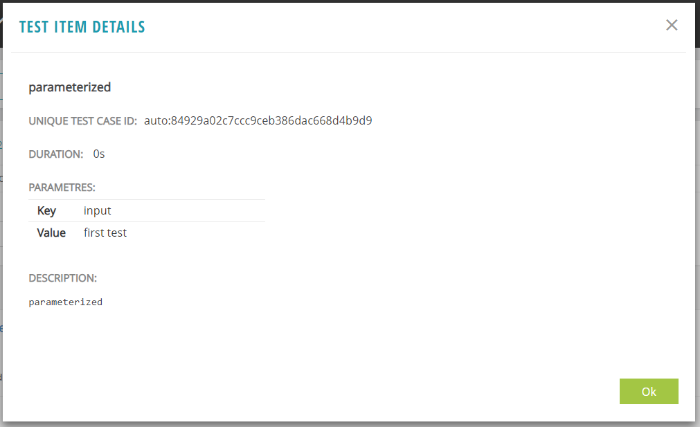
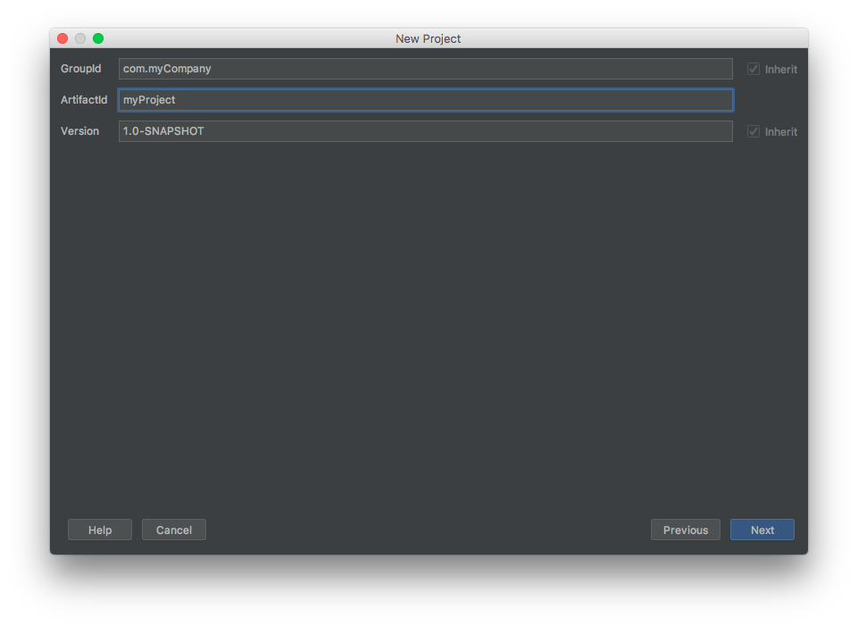
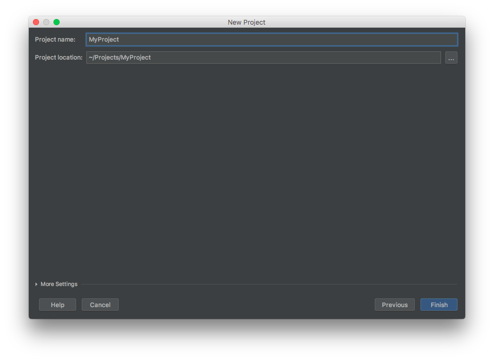
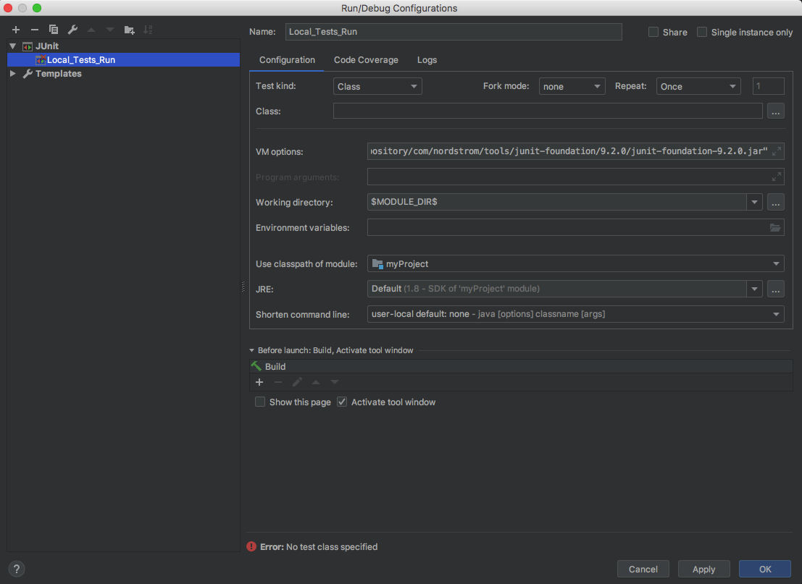

# Report Portal agent for JUnit 4

> **DISCLAIMER**: We use Google Analytics for sending anonymous usage information such as agent's and client's names, and their versions 
> after a successful launch start. This information might help us to improve both ReportPortal backend and client sides. It is used by the
> ReportPortal team only and is not supposed for sharing with 3rd parties.

[](https://central.sonatype.com/artifact/com.epam.reportportal/agent-java-junit)
[](https://github.com/reportportal/agent-java-junit/actions/workflows/ci.yml)
[](https://reportportal-slack-auto.herokuapp.com)
[](http://stackoverflow.com/questions/tagged/reportportal)
[](http://reportportal.io?style=flat)

### Overview: How to Add ReportPortal Logging to Your JUnit Java Project
Report Portal supports JUnit 4 tests. The integration is built on top of [JUnit Foundation](https://github.com/sbabcoc/JUnit-Foundation) framework by [Scott Babcock](https://github.com/sbabcoc).

1. [Configuration](#configuration): Create/update the **_reportportal.properties_** configuration file
2. [Logback Framework](#logback-framework): For the Logback framework:  
   a. Create/update the **_logback.xml_** file  
   b. Add ReportPortal / Logback dependencies to your project POM
3. [Log4J Framework](#log4j-framework): For the Log4J framework:  
   a. Add ReportPortal / Log4J dependencies to your project POM
4. [Support for Parameterized Tests](#support-for-parameterized-tests): Reporting of test parameters
5. [Images and Files](#images-and-files): Logging images and files
6. [Step by step instruction](#reportportal-integration-with-junit-4): Report Portal and JUnit4 integration example

### Configuration

#### Create/update the reportportal.properties configuration file:
Create or update a file named reportportal.properties in your Java project in source folder src/main/resources:

`reportportal.properties`
```
rp.endpoint = http://localhost:8080
rp.uuid = e0e541d8-b1cd-426a-ae18-b771173c545a
rp.launch = default_JUNIT_AGENT
rp.project = default_personal
```

* The value of the **rp.endpoint** property is the URL for the report portal server(actual link).
* The value of the **rp.uuid** property can be found on your report portal user profile page.
* The value of the **rp.project** property must be set to one of your assigned projects.
* The value of the **rp.launch** property is a user-selected identifier for the source of the report output (i.e. - the Java project)

### Logback Framework

#### Create/update the logback.xml file:

In your project, create or update a file named logback.xml in the src/main/resources folder, adding the ReportPortal elements:

`logback.xml`
```xml
<?xml version="1.0" encoding="UTF-8"?>
<configuration>
 
    <!-- Send debug messages to System.out -->
    <appender name="STDOUT" class="ch.qos.logback.core.ConsoleAppender">
        <!-- By default, encoders are assigned the type ch.qos.logback.classic.encoder.PatternLayoutEncoder -->
        <encoder>
            <pattern>%d{HH:mm:ss.SSS} %-5level %logger{5} - %thread - %msg%n</pattern>
        </encoder>
    </appender>
 
    <appender name="RP" class="com.epam.reportportal.logback.appender.ReportPortalAppender">
        <encoder>
            <!--Best practice: don't put time and logging level to the final message. Appender do this for you-->
            <pattern>[%t] - %msg%n</pattern>
        </encoder>
    </appender>
 
    <!--'additivity' flag is important! Without it logback will double-log log messages-->
    <logger name="binary_data_logger" level="TRACE" additivity="false">
        <appender-ref ref="RP"/>
    </logger>
 
    <!-- By default, the level of the root level is set to DEBUG -->
    <root level="DEBUG">
        <appender-ref ref="RP"/>
        <appender-ref ref="STDOUT"/>
    </root>
</configuration>
```

#### Add ReportPortal / Logback dependencies to your project POM:

`pom.xml`
```xml
<project ...>
  <properties>
    <project.build.sourceEncoding>UTF-8</project.build.sourceEncoding>
    <maven.compiler.target>1.8</maven.compiler.target>
    <maven.compiler.source>1.8</maven.compiler.source>  	
  </properties>

  <dependencies>
    <dependency>
      <groupId>ch.qos.logback</groupId>
      <artifactId>logback-classic</artifactId>
      <version>1.2.10</version>
    </dependency>
    <dependency>
      <groupId>com.epam.reportportal</groupId>
      <artifactId>agent-java-junit</artifactId>
      <version>5.2.0</version>
    </dependency>
    <dependency>
      <groupId>com.epam.reportportal</groupId>
      <artifactId>logger-java-logback</artifactId>
      <version>5.1.1</version>
    </dependency>
  </dependencies>
 
  <build>
    <pluginManagement>
      <plugins>
        <!-- Add this if you plan to import into Eclipse -->
        <plugin>
          <groupId>org.eclipse.m2e</groupId>
          <artifactId>lifecycle-mapping</artifactId>
          <version>1.0.0</version>
          <configuration>
            <lifecycleMappingMetadata>
              <pluginExecutions>
                <pluginExecution>
                  <pluginExecutionFilter>
                    <groupId>org.apache.maven.plugins</groupId>
                    <artifactId>maven-dependency-plugin</artifactId>
                    <versionRange>[1.0.0,)</versionRange>
                    <goals>
                      <goal>properties</goal>
                    </goals>
                  </pluginExecutionFilter>
                  <action>
                    <execute />
                  </action>
                </pluginExecution>
              </pluginExecutions>
            </lifecycleMappingMetadata>
          </configuration>
        </plugin>
      </plugins>
    </pluginManagement>
    <plugins>
      <!-- This provides the path to the Java agent -->
      <plugin>
        <groupId>org.apache.maven.plugins</groupId>
        <artifactId>maven-dependency-plugin</artifactId>
        <version>3.1.1</version>
        <executions>
          <execution>
            <id>getClasspathFilenames</id>
            <goals>
              <goal>properties</goal>
            </goals>
          </execution>
        </executions>
      </plugin>
      <plugin>
        <groupId>org.apache.maven.plugins</groupId>
        <artifactId>maven-surefire-plugin</artifactId>
        <version>2.22.0</version>
        <configuration>
          <argLine>-javaagent:${com.nordstrom.tools:junit-foundation:jar}</argLine>
        </configuration>
      </plugin>
    </plugins>
  </build>
</project>
```

### Log4J Framework

#### Add ReportPortal / Log4J dependencies to your project POM:

`pom.xml`
```xml
<project ...>
  <properties>
    <project.build.sourceEncoding>UTF-8</project.build.sourceEncoding>
    <maven.compiler.target>1.8</maven.compiler.target>
    <maven.compiler.source>1.8</maven.compiler.source>  	
  </properties>

  <dependencies>
    <dependency>
      <groupId>org.apache.logging.log4j</groupId>
      <artifactId>log4j-core</artifactId>
      <version>2.17.1</version>
    </dependency>
    <dependency>
      <groupId>org.apache.logging.log4j</groupId>
      <artifactId>log4j-api</artifactId>
      <version>2.17.1</version>
    </dependency>
    <dependency>
      <groupId>com.epam.reportportal</groupId>
      <artifactId>agent-java-junit</artifactId>
      <version>5.2.0</version>
    </dependency>
    <dependency>
      <groupId>com.epam.reportportal</groupId>
      <artifactId>logger-java-log4j</artifactId>
      <version>5.1.4</version>
    </dependency>
  </dependencies>
 
  <build>
    <pluginManagement>
      <plugins>
        <!-- Add this if you plan to import into Eclipse -->
        <plugin>
          <groupId>org.eclipse.m2e</groupId>
          <artifactId>lifecycle-mapping</artifactId>
          <version>1.0.0</version>
          <configuration>
            <lifecycleMappingMetadata>
              <pluginExecutions>
                <pluginExecution>
                  <pluginExecutionFilter>
                    <groupId>org.apache.maven.plugins</groupId>
                    <artifactId>maven-dependency-plugin</artifactId>
                    <versionRange>[1.0.0,)</versionRange>
                    <goals>
                      <goal>properties</goal>
                    </goals>
                  </pluginExecutionFilter>
                  <action>
                    <execute />
                  </action>
                </pluginExecution>
              </pluginExecutions>
            </lifecycleMappingMetadata>
          </configuration>
        </plugin>
      </plugins>
    </pluginManagement>
    <plugins>
      <!-- This provides the path to the Java agent -->
      <plugin>
        <groupId>org.apache.maven.plugins</groupId>
        <artifactId>maven-dependency-plugin</artifactId>
        <version>3.1.1</version>
        <executions>
          <execution>
            <id>getClasspathFilenames</id>
            <goals>
              <goal>properties</goal>
            </goals>
          </execution>
        </executions>
      </plugin>
      <plugin>
        <groupId>org.apache.maven.plugins</groupId>
        <artifactId>maven-surefire-plugin</artifactId>
        <version>2.22.0</version>
        <configuration>
          <argLine>-javaagent:${com.nordstrom.tools:junit-foundation:jar}</argLine>
        </configuration>
      </plugin>
    </plugins>
  </build>
</project>
```

### Gradle Configuration
```
apply plugin: 'java'
sourceCompatibility = 1.8
targetCompatibility = 1.8

description = 'ReportPortal JUnit 4 example'

repositories {
    mavenLocal()
    mavenCentral()
}

dependencies {
    compile 'com.epam.reportportal:logger-java-log4j:5.1.4'
    compile 'com.epam.reportportal:agent-java-junit:5.2.0'
}

test {
//  debug true
    jvmArgs "-javaagent:${classpath.find { it.name.contains('junit-foundation') }}"
    // not required, but definitely useful
    testLogging.showStandardStreams = true
}
```

### Support for Parameterized Tests

The implementation of this **Report Portal** agent is built on test event notifications generated by 
[JUnit Foundation](https://github.com/Nordstrom/JUnit-Foundation). In addition to single-pass tests, this library provides support for 
[parameterized tests](https://github.com/Nordstrom/JUnit-Foundation#support-for-parameterized-tests). Here's a basic example:

**Parameterized test class**
```java
package com.nordstrom.example;

import static org.junit.Assert.assertEquals;
import static org.junit.Assert.assertTrue;
import static com.nordstrom.automation.junit.ArtifactParams.param;

import java.util.Map;
import java.util.Optional;

import org.junit.Rule;
import org.junit.Test;
import org.junit.runner.Description;
import org.junit.runner.RunWith;
import org.junit.runners.Parameterized;
import org.junit.runners.Parameterized.Parameters;

import com.nordstrom.automation.junit.ArtifactParams;
import com.nordstrom.automation.junit.AtomIdentity;


import com.nordstrom.automation.junit.ArtifactParams;
import com.nordstrom.automation.junit.AtomIdentity;

@RunWith(Parameterized.class)
public class ParameterizedTest implements ArtifactParams {
    
    @Rule
    public final AtomIdentity identity = new AtomIdentity(this);
    
    private String input;
    
    public ParameterizedTest(String input) {
        this.input = input;
    }
    
    @Parameters
    public static Object[] data() {
        return new Object[] { "first test", "second test" };
    }
    
    @Override
    public Description getDescription() {
        return identity.getDescription();
    }
    
    @Override
    public Optional<Map<String, Object>> getParameters() {
        return ArtifactParams.mapOf(param("input", input));
    }
    
    @Test
    public void parameterized() {
        System.out.println("invoking: " + getDescription().getMethodName());
        Optional<Map<String, Object>> params = identity.getParameters();
        assertTrue(params.isPresent());
        assertTrue(params.get().containsKey("input"));
        assertEquals(input, params.get().get("input"));
    }
}
```

When sending reports for tests in parameterized classes like this, the JUnit agent for **Report Portal** includes a record of the parameters that the tests were operating on. Below is an example of test item details for the `parameterized()` test, showing the value of the `input` parameter this test ran with.



### Images and Files

http://reportportal.io/docs/Logging-Integration%3Elog-message-format

In addition to text log messages, ReportPortal has the ability to record images and file contents. The link above documents the formats supported by the report portal test listener for representing these artifacts.

### ReportPortal integration with JUnit 4

This manual will walk you through the steps for integration of Report Portal with JUnit4 based project

First, make sure you have installed Report Portal, the installation steps could be found [here](http://reportportal.io/docs/Installation-steps)

We’ll assume that Report Portal is installed and running on <http://localhost:8080>

#### Step 1 - Create new project (Maven)

> If you want to integrate Report Portal with existing project, go to step 2

##### 1.1 Start new maven project


##### 1.2 Enter GroupId and ArtifactId 



##### 1.3 Enter project name



#### Step 2 - Configure pom.xml

##### 2.1 Add following dependencies:

*Report Portal agent implementation for JUnit 4*
```xml
<dependency>
    <groupId>com.epam.reportportal</groupId>
    <artifactId>agent-java-junit</artifactId>
    <version>5.2.0</version>
    <scope>test</scope>
</dependency>
```
Note that `agent-java-junit` brings in `JUnit` and the `JUnit Foundation` library as transitive dependencies, so these don't need to be declared explicitly in your project.

> Latest version of the agent, could be found [here](https://search.maven.org/search?q=g:%22com.epam.reportportal%22%20AND%20a:%22agent-java-junit%22)

##### 2.2 Add Report Portal dedicated logger wrapper  

If you prefer using **Logback** logging library, add following dependencies:

*ReportPortal logback logger dependency*
```xml
<dependency>
    <groupId>com.epam.reportportal</groupId>
    <artifactId>logger-java-logback</artifactId>
    <version>5.1.1</version>
</dependency>
```
> Up to date version could be found [here](https://search.maven.org/search?q=g:%22com.epam.reportportal%22%20AND%20a:%22logger-java-logback%22)

*The logback itself*
```xml
<dependency>
    <groupId>ch.qos.logback</groupId>
    <artifactId>logback-classic</artifactId>
    <version>1.2.10</version>
</dependency>
```

If you prefer using **Log4j** logging library, add following dependencies:

*ReportPortal log4j logger dependency*
```xml
<dependency>
    <groupId>com.epam.reportportal</groupId>
    <artifactId>logger-java-log4j</artifactId>
    <version>5.1.4</version>
</dependency>
```
> Up to date version could be found [here](https://search.maven.org/search?q=g:%22com.epam.reportportal%22%20AND%20a:%22logger-java-log4j%22)

*The log4j itself*
```xml
<dependency>
    <groupId>org.apache.logging.log4j</groupId>
    <artifactId>log4j-api</artifactId>
    <version>2.17.1</version>
</dependency>

<dependency>
     <groupId>org.apache.logging.log4j</groupId>
     <artifactId>log4j-core</artifactId>
     <version>2.17.1</version>
</dependency>
```

#### Step 3 - Add the test with logging

##### 3.1 Add simple test method

Create a test class `MyTests` in the test directory and add JUnit 4 test method there
```java
package com.mycompany.tests;

import org.apache.logging.log4j.LogManager;
import org.apache.logging.log4j.Logger;
import org.junit.Test;

public class MyTests {

    private static final Logger LOGGER = LogManager.getLogger(MyTests.class);
    
    @Test
    public void testMySimpleTest() {
        LOGGER.info("Hello from my simple test");
    }
}
```

##### 3.2 Add `log4j2.xml` file to `resources` folder  
*Example:*
```xml
<?xml version="1.0" encoding="UTF-8"?>
<Configuration packages="com.epam.ta.reportportal.log4j.appender" status="WARN">
    <Appenders>
        <Console name="ConsoleAppender" target="SYSTEM_OUT">
            <PatternLayout
                    pattern="%d [%t] %-5level %logger{36} - %msg%n%throwable"/>
        </Console>
        <ReportPortalLog4j2Appender name="ReportPortalAppender">
            <PatternLayout
                    pattern="%d [%t] %-5level %logger{36} - %msg%n%throwable"/>
        </ReportPortalLog4j2Appender>
    </Appenders>
    <Loggers>
        <Root level="DEBUG">
            <AppenderRef ref="ConsoleAppender"/>
            <AppenderRef ref="ReportPortalAppender"/>
        </Root>
    </Loggers>
</Configuration>
```
It's needed to add `ReportPortalAppender` into this (as shown in the example)  

By this moment, your project tree should look somewhat like the this:


 
#### Step 4 - Configuring ReportPortal

##### 4.1 Open ReportPortal UI 

Go to *http:$IP_ADDRESS_OF_REPORT_PORTAL:8080* (by default it is *http://localhost:8080*)
  
Login as **Admin** user and create the project (more details [here](http://reportportal.io/docs/Deploy-ReportPortal) and [here](http://reportportal.io/docs/Creation-of-project))


##### 4.2 Add users to your project:

Go to *Administrative* -> *My Test Project* -> *Members* -> *Add user*   
> Example link *http://localhost:8080/ui/#administrate/project-details/my_test_project/members* 


#### Step 5 - Link ReportPortal with your tests 

#### Step 5.1 - Add `reportportal.properties` 

After you have created new user in your project, you can get `reportportal.properties` file example from the user *Profile* page
 
To do that, login as created user and go to *User icon* in header -> *Profile*  

There, in *Configuration Examples* section, you can find the example of `reportportal.properties` file for that user


Returning back to the code. In your project, create file named `reportportal.properties` in `resources` folder and copy&paste the contents form the user profile page

*Example:*

`reportportal.properties`
```properties
rp.endpoint = http://localhost:8080
rp.uuid = d50810f1-ace9-44fc-b1ba-a0077fb3cc44
rp.launch = jack_TEST_EXAMPLE
rp.project = my_test_project
rp.enable = true
```

> More details on `reportportal.properties` file could be found [here](http://reportportal.io/docs/JVM-based-clients-configuration)

#### Step 5.2 - Make Report Portal agent invoked by the tests

Current *Report Portal JUnit 4 Agent* implementation uses "junit-foundation" library to intercept test steps and make possible to generate 
test-reports.
> More about "junit-foundation" could be found [here](https://github.com/Nordstrom/JUnit-Foundation)

So we need to inject the "junit-foundation' library into our running tests. 
There are multiple ways for doing that

* method 1 - via Maven Surefire/Failsafe plugin (maven only)
* method 2 - via IDE Run configurations
* method 3 - via Gradle (gradle only)

##### Common Step - add service reference to your test resources
JUnit Foundation uses Java's Service Location mechanism to pick JUnit listeners. That also means you can specify multiple custom listeners
and have them all reporting your test launch. To specify Report Portal Agent service reference create 
`META-INF/services/com.nordstrom.automation.junit.JUnitWatcher` file (note the directory path) in your `resources` directory. E.G. in
`src/test/resources`. With the following content:
```none
com.epam.reportportal.junit.ReportPortalListener

```
> Prior to agent version 5.1 there was no need in this step, because the service was specified inside our package. But that caused troubles
> for those users who used their own customized agents based on our implementation. So to allow everyone to customize the agent service 
> location was removed from our code.

##### Method 1 - using Maven Surefire/Failsafe plugin (maven only)

Add the `build` section and Maven Surefire plugin with the following configuration section to `pom.xml`

```xml
   <build>
      <pluginManagement>
         <plugins>
            <!-- This part is only needed for Eclipse IDE users-->
            <plugin>
               <groupId>org.eclipse.m2e</groupId>
               <artifactId>lifecycle-mapping</artifactId>
               <version>1.0.0</version>
               <configuration>
                  <lifecycleMappingMetadata>
                     <pluginExecutions>
                        <pluginExecution>
                           <pluginExecutionFilter>
                              <groupId>org.apache.maven.plugins</groupId>
                              <artifactId>maven-dependency-plugin</artifactId>
                              <versionRange>[1.0.0,)</versionRange>
                              <goals>
                                 <goal>properties</goal>
                              </goals>
                           </pluginExecutionFilter>
                           <action>
                              <execute/>
                           </action>
                        </pluginExecution>
                     </pluginExecutions>
                  </lifecycleMappingMetadata>
               </configuration>
            </plugin>
         </plugins>
      </pluginManagement>
      <plugins>
         <!-- This plugin provides the path to the Java agent (used in surefire argLine part) -->
         <plugin>
            <groupId>org.apache.maven.plugins</groupId>
            <artifactId>maven-dependency-plugin</artifactId>
            <version>3.1.1</version>
            <executions>
               <execution>
                  <id>getClasspathFilenames</id>
                  <goals>
                     <goal>properties</goal>
                  </goals>
               </execution>
            </executions>
         </plugin>
         <plugin>
            <groupId>org.apache.maven.plugins</groupId>
            <artifactId>maven-surefire-plugin</artifactId>
            <version>2.22.0</version>
            <configuration>
               <argLine>-javaagent:${com.nordstrom.tools:junit-foundation:jar}</argLine>
            </configuration>
         </plugin>
      </plugins>
   </build>
```
Please pay attention on *Eclipse* users block, you can remove it if you're not using Eclipse

> Note - your IDE might get confused by the `argLine` value (in `maven-surefire-plugin` configuration section) and mark it as error. This is okay and argLine will still work, so you can set your IDE to ignore this error


> Note - in some cases the `maven-dependency-plugin` might also be marked red, since maven might be failing to download the dependency for it  
in this case - add a `maven dependency plugin` dependency explicitly, like this:
```xml
<dependency>
    <groupId>org.apache.maven.plugins</groupId>
    <artifactId>maven-dependency-plugin</artifactId>
    <version>3.1.1</version>
    <type>maven-plugin</type>
</dependency>
```
> After maven imported new dependency, you can remove this dependency block

*Full pom.xml file example*

`pom.xml`
```xml
<?xml version="1.0" encoding="UTF-8"?>
<project xmlns="http://maven.apache.org/POM/4.0.0"
         xmlns:xsi="http://www.w3.org/2001/XMLSchema-instance"
         xsi:schemaLocation="http://maven.apache.org/POM/4.0.0 http://maven.apache.org/xsd/maven-4.0.0.xsd">
   <modelVersion>4.0.0</modelVersion>

   <groupId>com.myCompany</groupId>
   <artifactId>myProject</artifactId>
   <version>1.0-SNAPSHOT</version>

   <dependencies>
      <dependency>
         <groupId>com.epam.reportportal</groupId>
         <artifactId>agent-java-junit</artifactId>
         <version>5.2.0</version>
         <scope>test</scope>
      </dependency>

      <dependency>
         <groupId>com.epam.reportportal</groupId>
         <artifactId>logger-java-log4j</artifactId>
         <version>5.1.4</version>
      </dependency>

      <dependency>
         <groupId>org.apache.logging.log4j</groupId>
         <artifactId>log4j-api</artifactId>
         <version>2.17.1</version>
      </dependency>

      <dependency>
         <groupId>org.apache.logging.log4j</groupId>
         <artifactId>log4j-core</artifactId>
         <version>2.17.1</version>
      </dependency>
   </dependencies>

   <build>
      <pluginManagement>
         <plugins>
            <!-- This part is only needed for Eclipse IDE users-->
            <plugin>
               <groupId>org.eclipse.m2e</groupId>
               <artifactId>lifecycle-mapping</artifactId>
               <version>1.0.0</version>
               <configuration>
                  <lifecycleMappingMetadata>
                     <pluginExecutions>
                        <pluginExecution>
                           <pluginExecutionFilter>
                              <groupId>org.apache.maven.plugins</groupId>
                              <artifactId>maven-dependency-plugin</artifactId>
                              <versionRange>[1.0.0,)</versionRange>
                              <goals>
                                 <goal>properties</goal>
                              </goals>
                           </pluginExecutionFilter>
                           <action>
                              <execute/>
                           </action>
                        </pluginExecution>
                     </pluginExecutions>
                  </lifecycleMappingMetadata>
               </configuration>
            </plugin>
         </plugins>
      </pluginManagement>
      <plugins>
         <!-- This plugin provides the path to the Java agent (used in surefire argLine part) -->
         <plugin>
            <groupId>org.apache.maven.plugins</groupId>
            <artifactId>maven-dependency-plugin</artifactId>
            <version>3.1.1</version>
            <executions>
               <execution>
                  <id>getClasspathFilenames</id>
                  <goals>
                     <goal>properties</goal>
                  </goals>
               </execution>
            </executions>
         </plugin>
         <plugin>
            <groupId>org.apache.maven.plugins</groupId>
            <artifactId>maven-surefire-plugin</artifactId>
            <version>2.22.0</version>
            <configuration>
               <!--suppress UnresolvedMavenProperty -->
               <argLine>-javaagent:${com.nordstrom.tools:junit-foundation:jar}</argLine>
            </configuration>
         </plugin>
      </plugins>
   </build>
</project>
```

Now the Report Portal agent is linked to your tests and when you run the tests with maven (e.g. `mvn clean test`) the results should be sent Report Portal

*Important note*. With this approach, only the tests executed using maven will be sent to Report Portal and local runs will not trigger the Report Portal agent and therefore the test-report won't be generated  
To have test results from local runs to be sent to Report Portal, follow the steps below

##### Method 2 - using IDE Run configurations

Another way to link local test runs with Report Portal is to add javaagent via Run Configurations of the IDE.

*Example for IntelliJ IDEA*

In Intellij IDEA go to *Run* -> *Edit Configurations* -> click on "+" sign -> select JUnit



Enter the name of the run, select classes and/or methods to be run in this configuration and add the following line into *VM Options* field:
```shell
-javaagent:"path/to/junit-foundation.jar"
```

You can put the jar directly in the project tree or use the one, that Maven downloaded from "Method 1"

On MAC OS system the path to maven downloaded junit-foundation.jar would have the following format:

```shell
/Users/<user_name>/.m2/repository/com/nordstrom/tools/junit-foundation/12.5.3/junit-foundation-12.5.3.jar
```

When you are done adding local run configuration, simply go to *Run* -> *Run '<test_run_name>'* and that test run results will be sent to Report Portal

##### Method 3 - using Gradle test task (Gradle only)

Assuming that you have the default `test` task in your `gradle.build` file, you need to add `jvmArgs` part and `junitFoundation` variable from artifacts using following code:

```gradle
test {
    jvmArgs "-javaagent:${classpath.find { it.name.contains('junit-foundation') }}"
    // your test task
}
```

And the full `build.gradle` file example:
```gradle
apply plugin: 'java'
sourceCompatibility = 1.8
targetCompatibility = 1.8

repositories {
    mavenLocal()
    mavenCentral()
}

dependencies {
    compile 'com.epam.reportportal:logger-java-log4j:5.1.4'
    compile 'com.epam.reportportal:agent-java-junit:5.2.0'
    compile 'org.apache.logging.log4j:log4j-api:2.17.1'
    compile 'org.apache.logging.log4j:log4j-core:2.17.1'
}

test {
    jvmArgs "-javaagent:${classpath.find { it.name.contains('junit-foundation') }}"
    testLogging.showStandardStreams = true
}
```

#### Step 6 - Observing test run report

After you linked the Report Portal JUnit 4 agent using one of the approaches described above, and ran your tests, you should be able to see the results in your ReportPortal instance  
To do that, login to ReportPortal, and go to *Left Panel* -> *Launches*  
You should see the launch there, with the name equal to the value of `rp.launch` from your `reportportal.properties` file  

*Example:* 


You can also see the test classes and individual test results by clicking on the launch name and going deeper


#### Step 7 - Reporting parameterized test results to ReportPortal

ReportPortal JUnit 4 agent supports presenting parameterized test results, again using the `junit-foundation` agent

Here is an example of simple parameterized test and the code required to have test results sent to ReportPortal:
```java
package com.mycompany.tests;

import com.nordstrom.automation.junit.ArtifactParams;
import com.nordstrom.automation.junit.AtomIdentity;
import org.apache.logging.log4j.LogManager;
import org.apache.logging.log4j.Logger;
import org.junit.Rule;
import org.junit.Test;
import org.junit.runner.Description;
import org.junit.runner.RunWith;
import org.junit.runners.Parameterized;
import org.junit.runners.Parameterized.Parameters;

import java.util.Map;
import java.util.Optional;

@RunWith(Parameterized.class)
public class MyParameterizedTests implements ArtifactParams {

    private static final Logger LOGGER = LogManager.getLogger(MyParameterizedTests.class);

    @Rule
    public final AtomIdentity identity = new AtomIdentity(this);

    private String input;

    public MyParameterizedTests(String input) {
        this.input = input;
    }

    @Parameters
    public static Object[] data() {
        return new Object[] { "param1", "param2" };
    }

    @Test
    public void simpleParameterizedTest() {
        LOGGER.info("running test: " + getDescription().getMethodName() + ", parameter: " + input);
    }

    @Override
    public Description getDescription() {
        return identity.getDescription();
    }

    @Override
    public Optional<Map<String, Object>> getParameters() {
        return ArtifactParams.mapOf(ArtifactParams.param("input", input));
    }

}
```

`AtomIdentity` and `ArtifactParams` are classes from `junit-foundation` that should be used to link parameterized test with ReportPortal

In this example we have 2 items in the Object array returned by `data()` method, this means that the test `simpleParameterizedTest` will be executed twice with different parameters

After running this test class, the results in Report Portal should look somewhat like this:

*Two invocations of parameterized test*


*Individual test result*


# Copyright Notice

Licensed under the [Apache 2.0](https://www.apache.org/licenses/LICENSE-2.0) license (see the LICENSE.md file).
